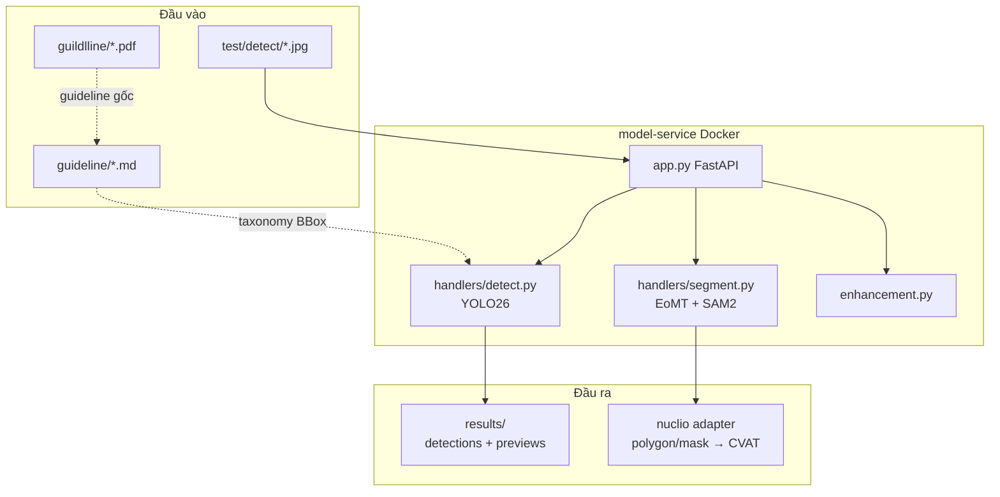

# Kiến trúc CVAT Browser Agent v2

Tài liệu này mô tả kiến trúc hiện tại sau refactor. Kiến trúc cũ (`app/` client, browser-use agent, DeepSeek selector) đã bị gỡ bỏ — không còn tồn tại trong repo.

## Kiến trúc hiện tại

```
                        ┌─────────────────────────────────────┐
                        │         model-service (Docker)      │
                        │         FastAPI + CUDA 12.4         │
                        │                                     │
  Ảnh ──────────────►   │  /detect            YOLO26 (BBox)   │
  (test/detect/*.jpg)   │  /segment-drivable  EoMT (Polygon)  │
                        │  /segment-semantic  EoMT + SAM2     │
                        │  /segment-auto      SAM2 auto-mask  │
                        │  /health                            │
                        └──────────────┬──────────────────────┘
                                       │ HTTP (host port 8001)
                                       ▼
                        ┌─────────────────────────────────────┐
                        │   nuclio/semantic-segment (adapter) │
                        │   polygon / mask  →  CVAT            │
                        └─────────────────────────────────────┘
```

## Sơ đồ tổng thể



## Thành phần

| Thành phần | Vai trò |
|---|---|
| `model-service/app.py` | FastAPI routes: `/health`, `/detect`, `/segment-drivable`, `/segment-auto`, `/segment-semantic` |
| `model-service/handlers/detect.py` | YOLO26 object detection, load model 1 lần (`lru_cache`), map COCO → guideline |
| `model-service/handlers/segment.py` | Semantic (EoMT) + drivable area (Polygon) + SAM2 refine + auto mask |
| `model-service/enhancement.py` | Tiền xử lý ảnh (tăng sáng vùng tối) |
| `model-service/Dockerfile` | Base `nvidia/cuda:12.4.1-cudnn`, torch cu124, nhúng EoMT vào image |
| `nuclio/semantic-segment/nuclio/model_handler.py` | Adapter chuyển response → CVAT polygon/mask |
| `guildlline/` | PDF guideline gốc (BBox/Polygon/Polyline + Semantic) |
| `guideline/` | Markdown guideline đã chuẩn hóa |
| `test/detect/` | 25 ảnh test |
| `results/` | Kết quả batch test |

## Taxonomy (nguồn sự thật duy nhất)

Toàn bộ taxonomy nằm trong **`taxonomy.yaml`**. `tools/sync_taxonomy.py` sinh ra
`model-service/taxonomy.json`, và `handlers/detect.py` / `handlers/segment.py`
đọc file đó (raise khi import nếu thiếu). Không có bảng map nào hardcode trong
code nữa — kiểm tra lệch bằng `python tools/sync_taxonomy.py --check`.

### Detection (COCO → guideline), task `bbox`

| COCO | Guideline |
|---|---|
| person | pedestrian |
| bicycle | bicycle |
| car | car |
| motorcycle | motorcycle |
| bus | bus |
| train | train |
| truck | truck |
| traffic light | traffic light |
| stop sign | traffic sign |

Các class khác bị lọc. **Giới hạn**: `rider` không phân biệt được với `person`; `traffic sign` chỉ phủ `stop sign`.

### Drivable area / lane marking (COCO → guideline), task `drivable`

| COCO (EoMT)      | Guideline          |
| ---------------- | ------------------ |
| `road`           | `area/drivable`    |
| `pavement-merged`| `area/alternative` |

**Lane marking (`lane/*`) không được sinh ra** — COCO-panoptic không có class `lane/*`; đây là limitation rõ ràng, cần label polyline riêng để train. Nhóm `lane` được khai báo trong `taxonomy.yaml` với `supported: false` + `unsupported_reason`, và `/segment-drivable` trả về đúng lý do đó.

## Ranh giới trách nhiệm

- YOLO26 chỉ trả BBox (object detection), không dùng box từ SAM2.
- EoMT là nguồn class/pixel cho segmentation; SAM2 chỉ refine biên hoặc sinh mask candidate.
- Adapter Nuclio có 3 nhánh: `smart-bbox` (rectangle), `smart-semantic` (polygon), `smart-drivable` (polygon).
- `taxonomy.yaml` là nguồn taxonomy chính khi runtime; `guideline/` là bản diễn giải cho người đọc, PDF gốc chỉ là tài liệu tham chiếu.

## Đã gỡ bỏ (không còn tồn tại)

Các thành phần sau có trong tài liệu cũ nhưng **đã bị xoá** khỏi repo:

- `app/` (client CLI, pipeline, web UI, browser agent)
- `run_console.ps1`, `D:\browser-user\.venv`
- DeepSeek selector / review client
